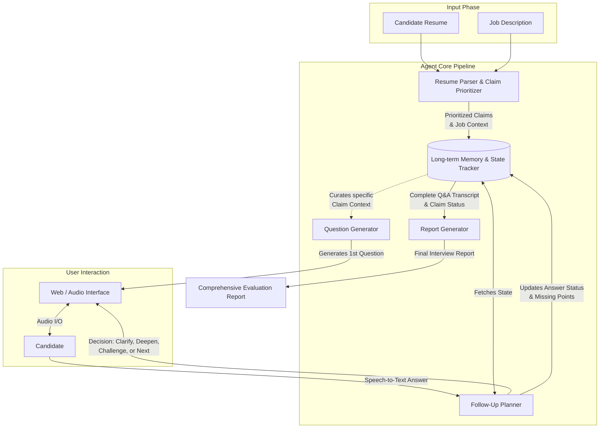

# AI Tech Interviewer

An intelligent, autonomous AI-driven technical interviewer that conducts deep-dive technical interviews based on a candidate's resume and job description. Instead of simple Q&A, it employs a state-machine-controlled interviewing agent with long-term memory to probe for depth, challenge assumptions, and verify claims, concluding with a comprehensive evaluation report.

## 🌟 Key Features

- **Automated Resume Parsing & Profiling:** Extracts verifiable technical claims from a resume and prioritizes them based on JD relevance and business impact.
- **Stateful Interview Engine:** Tracks the state of each "Claim" (verified, unverified, missing points) logically, not just conversationally.
- **Dynamic Follow-Up Planning:** Analyzes candidate answers in real-time to determine if the agent should clarify gaps, challenge superficial answers, deepen the technical scope, or move to the next topic.
- **Voice-Native Architecture:** Optimized for low latency TTS (Text-to-Speech) via sentence-level SSE streaming, enabling audio playback to begin while the LLM is still generating.
- **Comprehensive Evaluation Reports:** Evaluates candidates on multiple dimensions (technical depth, evidence, relevance, specificity) with complete Q&A traceability.
- **Fallback Mechanisms:** Built-in deterministic overrides ensure the interview never hangs or spirals into infinite loops.
- **Idempotent Turn Processing:** Each interview turn carries a unique `requestId`, enabling safe retries without duplicate transcript entries or state corruption.
- **Invite-Token Authentication:** Candidates authenticate via SHA-256 hashed single-use tokens with expiration, usage limits, IP audit logging, and reconnection support.
- **LLM Cost Observability:** Every Gemini API call (text and TTS) is logged with token counts, latency, and estimated cost to a centralized `llm_usage_logs` table.
- **Prompt Injection Hardening:** System instructions and candidate-sourced data are structurally separated, with candidate answers wrapped in explicit `<candidate_answer>` tags to prevent prompt override attacks.

## 🧠 System Architecture



## 🧩 Core Components

The agent resides entirely under `src/agent/` and operates as a composite multi-step processing system rather than a single LLM call.

### 1. `memory.ts` - Long-term Memory & State Tracker
The "brain" of the agent. It eschews dumping raw chat history into the context window, instead explicitly modeling the interview state. It tracks global metrics (consecutive non-answers, total questions, consecutive failed claims) and per-claim variables (must-verify points, covered points, follow-up counts). This state-machine design forces the LLM to act methodically. Supports full transcript-based state reconstruction for server-side stateless execution and session reconnection.

### 2. `resumeParser.ts` - Parser & Prioritizer
Pre-processes the resume and target JD using `gemini-3-flash-preview`. It extracts the most impactful 2-5 claims (e.g., system design, experimentation) and breaks them down into "Must Verify" points and "Evidence Hints", reducing token usage and focusing the interview on high-yield technical signals.

### 3. `followUpPlanner.ts` - Dynamic Routing & Follow-up Planner
The most complex logic node. After a candidate speaks, it evaluates the answer status (e.g., `answered`, `partial`, `non_answer`). Based on the status and the memory tracker's variables, it routes the interview intent:
- **`CLARIFY_GAP`**: Asks about specific missing technical pieces.
- **`DEEPEN`**: Pushes for scalability, limits, and architectural trade-offs if the baseline is met.
- **`CHALLENGE`**: Pushes back on "too-perfect" or ambiguous answers to verify authenticity.
Features robust fallback logic (Deterministic Overrides) to force claim advancement if the interaction gets stuck.

### 4. `questionGenerator.ts` - Break the Ice
Generates the initial questions transitioning smoothly from introductions to technical claims, specifically generating both full-text logic strings and TTS-optimized rapid `spokenQuestion` strings to maintain low-latency voice interactions.

### 5. `reportGenerator.ts` - Evaluation & Scoring
Utilizes `gemini-3.1-pro-preview` post-interview to parse the precise event-log of the interview. Maps candidate answers back to original resume claims to explicitly score Technical Depth, Clarity, and Ownership, producing a documented Hire / No-Hire recommendation.

---

## 🔧 Production Infrastructure

### Streaming Pipeline (SSE)
The `next-step` API returns an SSE (`text/event-stream`) response that streams `sentence` events as the LLM generates each sentence of the spoken question. The client starts TTS synthesis for each sentence immediately — achieving ~1-2s time-to-first-audio versus the previous 3-5s wait-for-full-response model. Falls back to standard JSON for fast-path responses (non-answer detection, idempotent replays).

### Idempotent Turn Processing
Each turn carries a unique `requestId`. Before executing the LLM, the API checks if a turn with that `requestId` already exists in the transcript table. If found, it returns the cached result without re-invoking the LLM — preventing duplicate turns on network retries or client reconnections.

### Background Persistence via `waitUntil`
Database writes (transcript insertion, phase updates) are deferred to Vercel Edge Runtime's `ctx.waitUntil()`, allowing the response to be sent immediately while persistence completes in the background. Gracefully degrades to fire-and-forget when `waitUntil` is unavailable.

### Non-Answer Fast Path
Obvious non-answers (e.g., "不知道", "pass", "I don't know") are detected via regex before reaching the LLM, saving ~1s latency and one Gemini API call per skipped turn.

### Session Reaper (Cron)
A Vercel Cron job (`/api/admin/reaper`) runs every 15 minutes to mark stale `IN_PROGRESS` sessions (>45 min) as `NOT_FINISHED`, preventing orphaned sessions from blocking report generation.

### LLM Usage Logger (`llm-logger.ts`)
A centralized, fire-and-forget logger that:
- Estimates cost from a maintained per-model pricing table (USD per 1M tokens)
- Logs every LLM call (start, next-step, generate-report, tts-stream) with token counts, latency, and cost to `llm_usage_logs`
- Postgres triggers auto-increment session-level aggregate counters

### Invite Token Auth (`api-auth.ts`)
Dual-path authentication supporting Supabase JWT (HR dashboard) and SHA-256 hashed invite tokens (candidates). Token validation includes expiration checks, revocation status, usage limits, session age enforcement (24h max), and IP-based reconnection verification with async audit logging.

### Report Generation Hardening (`generate-report.ts`)
- **Atomic GENERATING lock** prevents race conditions from concurrent report requests
- **45s LLM execution timeout** with watchdog timer for stream stalls
- **Structured rollback** on failure: restores session to `INTERVIEW_ENDED` with failure metadata (`retry_count`, `failure_reason`, `error_type`)
- **JSON repair** via `jsonrepair` for partial LLM outputs
- **Post-processing**: zero-out scores for claims where all turns were non-answers
- **Structured logging** with request tracing (`request_id`, `user_id`, `latency_ms`)

---

## 🧪 Test Suite

The project includes a multi-layered test framework using **Vitest**:

### Unit Tests (`tests/unit/`)
- **`memory.test.ts`** — InterviewMemory state machine: transcript restoration, claim advancement, counter tracking
- **`decision-engine.test.ts`** — Deterministic override logic: forced claim advancement, graceful timeouts, non-answer escalation
- **`behavioral-metrics.test.ts`** — Behavioral metrics: follow-up depth, recovery rates, consecutive failure handling
- **`auth.test.ts`** — Token validation, expiration, revocation, IP matching
- **`status-transitions.test.ts`** — Session lifecycle state transitions
- **`llm-output-safety.test.ts`** — LLM output sanitization and prompt injection defense

### Eval Tests (`tests/eval/`)
- **`eval-metrics.test.ts`** — Golden-set regression for LLM judgment calibration
- **`eval-next-step.test.ts`** — Follow-up planner decision quality evaluation
- **`eval-report.test.ts`** — Report generation scoring consistency
- **`golden-answers.ts`** — Curated test fixtures for evaluation baselines

### Integration Tests (`tests/integration/`)
- **`interview-flow.test.ts`** — End-to-end interview flow with multi-claim state transitions

---

## 🚀 Run Locally

**Prerequisites:** Node.js (v18+)

1. **Install dependencies:**
   ```bash
   npm install
   ```

2. **Environment Setup:**
   Create a `.env.local` file in the root directory and set your API keys:
   ```env
   GEMINI_API_KEY="your_google_gemini_api_key"
   VITE_SUPABASE_URL="your_supabase_url"
   VITE_SUPABASE_ANON_KEY="your_supabase_key"
   SUPABASE_SERVICE_ROLE_KEY="your_service_role_key"
   ```

3. **Run the development server:**
   ```bash
   npm run dev
   ```

4. **Run tests:**
   ```bash
   npx vitest run
   ```

5. **Access the App:**
   Open your browser and navigate to the local URL (usually `http://localhost:5173`).

---
*Built with React, Vite, Supabase, and powered by Gemini 3.0 & 3.1 Pro via Google GenAI SDK. Deployed on Vercel Edge Runtime.*
