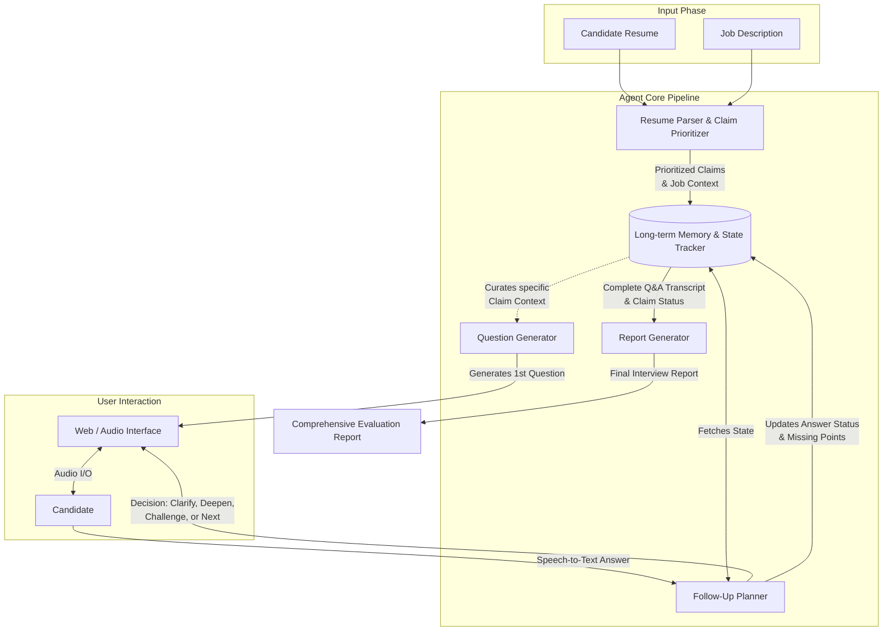

# AI Tech Interviewer

An intelligent, autonomous AI-driven technical interviewer that conducts deep-dive technical interviews based on a candidate's resume and job description. Instead of simple Q&A, it employs a state-machine-controlled interviewing agent with long-term memory to probe for depth, challenge assumptions, and verify claims, concluding with a comprehensive evaluation report.

## 🌟 Key Features

- **Automated Resume Parsing & Profiling:** Extracts verifiable technical claims from a resume and prioritizes them based on JD relevance and business impact.
- **Stateful Interview Engine:** Tracks the state of each "Claim" (verified, unverified, missing points) logically, not just conversationally.
- **Dynamic Follow-Up Planning:** Analyzes candidate answers in real-time to determine if the agent should clarify gaps, challenge superficial answers, deepen the technical scope, or move to the next topic.
- **Voice-Native Architecture:** Optimized for low latency TTS (Text-to-Speech) by generating concise, spoken-friendly questions alongside structured logic.
- **Comprehensive Evaluation Reports:** Evaluates candidates on multiple dimensions (technical depth, evidence, relevance, specificity) with complete Q&A traceability.
- **Fallback Mechanisms:** Built-in deterministic overrides ensure the interview never hangs or spirals into infinite loops.

## 🧠 System Architecture



## 🧩 Core Components

The agent resides entirely under `src/agent/` and operates as a composite multi-step processing system rather than a single LLM call.

### 1. `memory.ts` - Long-term Memory & State Tracker
The "brain" of the agent. It eschews dumping raw chat history into the context window, instead explicitly modeling the interview state. It tracks global metrics (consecutive non-answers, total questions) and per-claim variables (must-verify points, covered points, follow-up counts). This state-machine design forces the LLM to act methodically.

### 2. `resumeParser.ts` - Parser & Prioritizer
Pre-processes the resume and target JD using `gemini-3-flash-preview`. It extracts the most impactful 2-5 claims (e.g., system design, experimentation) and breaks them down into "Must Verify" points and "Evidence Hints", reducing token usage and focusing the interview on high-yield technical signals.

### 3. `followUpPlanner.ts` - Dynamic Routing & Follow-up Planner
The most complex logic node. After a candidate speaks, it evaluates the answer status (e.g., `answered`, `partial`, `non_answer`). Based on the status and the memory tracker's variables, it routes the interview intent:
- **`CLARIFY_GAP`**: Asks about specific missing technical pieces.
- **`DEEPEN`**: Pushes for scalability, limits, and architectural trade-offs if the baseline is met.
- **`CHALLENGE`**: Pushes back on "too-perfect" or ambiguous answers to verify authenticity.
Features robust fallback logic (Deterministic Overrides) to force claim advancement if the interaction gets stuck.

### 4. `questionGenerator.ts` - Break the Ice
Generates the initial questions transitioning smoothly from introductions to technical claims, specifically generating both full-text logic strings and TTS-optimized rapid `spokenQuestion` strings to maintain low-latency voice interactions.

### 5. `reportGenerator.ts` - Evaluation & Scoring
Utilizes `gemini-3.1-pro-preview` post-interview to parse the precise event-log of the interview. Maps candidate answers back to original resume claims to explicitly score Technical Depth, Clarity, and Ownership, producing a documented Hire / No-Hire recommendation.

---

## 🚀 Run Locally

**Prerequisites:** Node.js (v18+)

1. **Install dependencies:**
   ```bash
   npm install
   ```

2. **Environment Setup:**
   Create a `.env.local` file in the root directory and set your API keys:
   ```env
   GEMINI_API_KEY="your_google_gemini_api_key"
   VITE_SUPABASE_URL="your_supabase_url" # Optional if using local storage
   VITE_SUPABASE_ANON_KEY="your_supabase_key"
   ```

3. **Run the development server:**
   ```bash
   npm run dev
   ```

4. **Access the App:**
   Open your browser and navigate to the local URL (usually `http://localhost:5173`).

---
*Built with React, Vite, Supabase, and powered by Gemini 3.0 & 3.1 Pro via Google GenAI SDK.*
