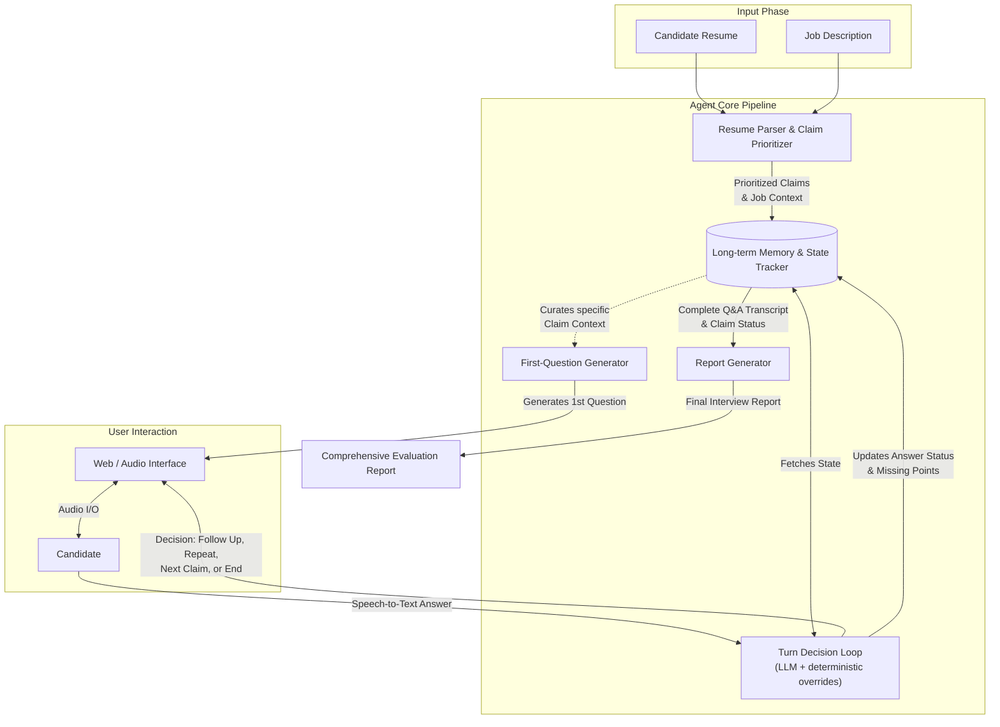

# AI Tech Interviewer

An intelligent, autonomous AI-driven technical interviewer that conducts deep-dive technical interviews based on a candidate's resume and job description. Instead of simple Q&A, it employs a state-machine-controlled interviewing agent with long-term memory to probe for depth, challenge assumptions, and verify claims, concluding with a comprehensive evaluation report.

## 🌟 Key Features

- **Automated Resume Parsing & Profiling:** Extracts verifiable technical claims from a resume and prioritizes them based on JD relevance and business impact.
- **Stateful Interview Engine:** Tracks the state of each "Claim" (verified, unverified, missing points) logically, not just conversationally.
- **Adaptive Follow-Up Planning:** Analyzes candidate answers in real time to clarify gaps, challenge superficial answers, deepen technical scope, or advance to the next topic — with per-claim depth floors and caps so strong candidates move faster and weak answers get bounded probing.
- **Voice-Native Architecture:** Optimized for low-latency TTS via sentence-level SSE streaming, so audio playback begins while the LLM is still generating. Bilingual (中文 / English) with barge-in interruption, staged silence escalation, a typed-answer fallback, and seamless reconnection.
- **Comprehensive Evaluation Reports:** Evaluates candidates on multiple dimensions (technical depth, evidence, relevance, specificity) with complete Q&A traceability.
- **Deterministic Guardrails:** The LLM is prompted with the exact state-machine constraints each turn, and a unit-tested override ladder enforces them as a backstop — the interview can never hang, loop, or overrun its limits.
- **Idempotent Turn Processing:** Each interview turn carries a unique `requestId` and is persisted durably before the client advances, enabling safe retries without duplicate transcript entries or state corruption.
- **Rate Limiting & Cost Ceilings:** Per-session fixed-window rate limits (Postgres-backed, no Redis) plus a hard per-session spend ceiling stop scripted floods and runaway billing.
- **Invite-Token Authentication:** Candidates authenticate via SHA-256 hashed single-use tokens with expiration, usage limits, IP audit logging, and reconnection support.
- **LLM Cost Observability:** Every Gemini API call (text and TTS) is logged with token counts, latency, and estimated cost to a centralized `llm_usage_logs` table.
- **Prompt Injection Hardening:** System instructions and candidate-sourced data are structurally separated, with candidate answers wrapped in explicit `<candidate_answer>` tags to prevent prompt override attacks.

## 🧠 System Architecture


```mermaid
flowchart TD
    subgraph Input Phase
        Resume[Candidate Resume]
        JD[Job Description]
    end

    subgraph Agent Core Pipeline
        Parser[Resume Parser & Claim Prioritizer]
        Memory[(Long-term Memory & State Tracker)]
        InitQ[First-Question Generator]
        Engine["Turn Decision Loop<br/>(LLM + deterministic overrides)"]
        ReportGen[Report Generator]
    end

    subgraph User Interaction
        FrontEnd[Web / Audio Interface]
        Candidate[Candidate]
    end

    Resume --> Parser
    JD --> Parser
    Parser -->|"Prioritized Claims\n& Job Context"| Memory

    Memory -.->|"Curates specific\nClaim Context"| InitQ
    InitQ -->|"Generates 1st Question"| FrontEnd
    FrontEnd <-->|"Audio I/O"| Candidate
    
    Candidate -->|"Speech-to-Text Answer"| Engine
    Memory <-->|"Fetches State"| Engine
    
    Engine -->|"Decision: Follow Up, Repeat,\nNext Claim, or End"| FrontEnd
    Engine -->|"Updates Answer Status\n& Missing Points"| Memory
    
    Memory -->|"Complete Q&A Transcript\n& Claim Status"| ReportGen
    ReportGen -->|"Final Interview Report"| Result[Comprehensive Evaluation Report]
```

## 🪜 Interview Flow

The interview is a server-driven state machine. Every turn re-derives the full state from the persisted transcript (stateless edge functions), decides, persists, then responds.

1. **System check & start** — the candidate verifies camera/mic/ASR/network, then the intro question plays while the first technical question is pre-computed from the first claim in the interview plan.
2. **Intro phase** — one self-introduction turn, then an atomic phase advance to `technical`.
3. **Technical phase** — the engine walks the prioritized claim set (grouped by experience). For each claim:
   - **Depth floor & caps:** at least 2 questions per claim; up to 2 follow-ups, plus 1 extra only if must-verify points are still missing (hard cap 3).
   - **Per-turn decisions:** `FOLLOW_UP`, `NEXT_CLAIM`, `REPEAT_QUESTION`, or `END_INTERVIEW`. The prompt receives the exact allowed decisions for the current state (rendered by `buildDecisionRules()` from the same values the override ladder enforces), so the model can advance adaptively once must-verify points are covered instead of always probing to the cap.
   - **Clarifications:** a question is repeated at most once — guarded both by `questionId` counting and a transcript-derived repeat streak, so "could you repeat that?" can never loop.
   - **Non-answers:** "不知道" / "I don't know"-style answers (including trailing ASR punctuation) resolve via a deterministic fast path with no LLM call: first one gets a gentler re-approach, a second consecutive one skips the claim, and two consecutive failed claims end the interview. The client's silence auto-skip marker takes the same path.
4. **Time budget** — graceful wind-down begins at 35 minutes (claims are force-advanced); a hard cutoff ends the interview at 40 minutes. A per-session cost ceiling ends it the same graceful way.
5. **Wrap-up & report** — the closing turn marks the session `INTERVIEW_ENDED`, and the evaluation report is generated from the structured transcript.

Because spoken sentences stream out before the deterministic override ladder runs, any turn whose question gets rewritten by an override also emits a corrective sentence event — the audio the candidate hears always ends on the same question that is displayed, persisted, and replayed into memory.

## 🧩 Core Components

### Live turn loop (`api/agent/` — Vercel Edge)
- **`start.ts`** — Atomically claims the session start (double-click/retry safe), generates the first technical question from the top claim with `gemini-3.5-flash`, and returns the intro.
- **`next-step.ts`** — The per-turn orchestrator: restores `InterviewMemory` from the transcript, runs the non-answer fast path, streams the LLM's spoken question sentence-by-sentence over SSE, applies the override ladder, and durably persists the turn before emitting the atomic `complete` event.
- **`decision-engine.ts`** — Pure, unit-tested decision logic with zero side effects: non-answer/skip-marker detection, the post-LLM override ladder (repeat-once, min-question floor, follow-up caps, forced advancement, covered-point sanitization), and `buildDecisionRules()`, the prompt-facing mirror of those same rules.

### Shared agent core (`src/agent/`)
- **`memory.ts`** — The "brain": explicitly models interview state instead of dumping raw chat history into context. Tracks global metrics (consecutive non-answers, consecutive failed claims) and per-claim variables (must-verify points, covered points, follow-up and repeat counts). Fully reconstructable from the transcript for stateless execution and session reconnection.
- **`resumeParser.ts` / `claimPrioritizer.ts`** — Extract the most impactful verifiable claims from resume + JD (via the authenticated `/api/generate` proxy on `gemini-3.5-flash`), each broken into "Must Verify" points and "Evidence Hints".
- **`reportGenerator.ts`** — Post-interview evaluation on `gemini-3.1-pro-preview`: maps answers back to the original claims and scores Technical Depth, Clarity, and Ownership into a documented Hire / No-Hire recommendation.

### Local & simulation mode (`src/agent/core.ts`, `followUpPlanner.ts`, `questionGenerator.ts`, `src/testing/`)
A browser-side agent loop (enabled with `VITE_USE_LOCAL_DB=true`) plus a simulation harness (`scripts/runBatchSimulation.ts`, fake candidates, LLM judge) for developing and benchmarking interviewing behavior without live sessions.

---

## 🔧 Production Infrastructure

### Streaming Pipeline (SSE)
The `next-step` API returns an SSE (`text/event-stream`) response that streams `sentence` events as the LLM generates each sentence of the spoken question. The client starts TTS synthesis per sentence immediately — achieving ~1-2s time-to-first-audio versus a 3-5s wait-for-full-response model. If the override ladder rewrites the question after sentences were already streamed, a corrective sentence event keeps audio and transcript consistent. Falls back to standard JSON for fast-path responses (non-answer detection, idempotent replays).

### Durable, Idempotent Turn Persistence
Each turn carries a unique `requestId` (rejected if missing — it is the sole idempotency key). Replayed requests return the cached turn without re-invoking the LLM. Every turn — including the intro's phase advance — is awaited to durable storage *before* the client is told to advance: a unique-violation (23505) counts as an idempotent retry, and any real persistence failure returns an error/`error` event so the client retries the **same** `requestId` instead of silently losing the turn.

### Rate Limiting & Cost Ceilings (`rate-limit.ts`)
Fixed-window per-session limits backed by Postgres (`incr_rate_limit` RPC — no Redis): 20/min interview turns, 45/min TTS calls, 30/min generate-proxy calls, 10/min report generations. The limiter fails open; the hard backstop is a per-session spend ceiling (default $2, ~4× a normal interview) plus a 250-call cap, enforced from denormalized counters and ended as gracefully as a timeout.

### Non-Answer Fast Path
Obvious non-answers ("不知道", "pass", "I don't know" — trailing ASR punctuation tolerated) and the client's machine-generated silence-skip markers are detected via regex before reaching the LLM, saving ~1s latency and one Gemini call per skipped turn while keeping skip behavior deterministic.

### Session Reaper (Cron)
A Vercel Cron job (`/api/admin/reaper`) runs every 15 minutes to mark stale `IN_PROGRESS` sessions (>45 min) as `NOT_FINISHED`, preventing orphaned sessions from blocking report generation.

### LLM Usage Logger (`llm-logger.ts`)
A centralized, fire-and-forget logger that:
- Estimates cost from a maintained per-model pricing table (USD per 1M tokens)
- Logs every LLM call (start, next-step, generate-report, tts-stream) with token counts, latency, and cost to `llm_usage_logs`
- Postgres triggers auto-increment session-level aggregate counters (which also feed the cost ceiling)

### Invite Token Auth (`api-auth.ts`)
Dual-path authentication supporting Supabase JWT (HR dashboard) and SHA-256 hashed invite tokens (candidates). Token validation includes expiration checks, revocation status, usage limits, session age enforcement (24h max), and IP-based reconnection verification with async audit logging. Every candidate endpoint additionally verifies the session context matches the authenticated identity.

### Report Generation Hardening (`generate-report.ts`)
- **Atomic GENERATING lock** prevents race conditions from concurrent report requests
- **45s LLM execution timeout** with watchdog timer for stream stalls
- **Structured rollback** on failure: restores session to `INTERVIEW_ENDED` with failure metadata (`retry_count`, `failure_reason`, `error_type`)
- **JSON repair** via `jsonrepair` for partial LLM outputs
- **Post-processing**: zero-out scores for claims where all turns were non-answers
- **Structured logging** with request tracing (`request_id`, `user_id`, `latency_ms`)

---

## 🧪 Test Suite

A multi-layered **Vitest** framework, run on every push/PR by GitHub Actions (type-check → unit + integration tests → build).

### Unit Tests (`tests/unit/`)
- **`memory.test.ts`** — InterviewMemory state machine: transcript restoration, claim advancement, counter and repeat-streak tracking
- **`decision-engine.test.ts`** — Non-answer/skip-marker detection, the full override ladder and its precedence, and the prompt-rule rendering that mirrors it
- **`next-step-persistence.test.ts`** — Durability contract: requestId guard, persist-before-respond, idempotent 23505 handling, phase-advance failures, rate limiting, cost ceiling, fast-path wiring
- **`behavioral-metrics.test.ts`** — Behavioral metrics: follow-up depth, recovery rates, consecutive failure handling
- **`auth.test.ts`** — Token validation, expiration, revocation, IP matching
- **`rate-limit.test.ts`** — Fixed-window limiter and fail-open behavior
- **`status-transitions.test.ts`** — Session lifecycle state transitions
- **`llm-output-safety.test.ts`** — LLM output sanitization and prompt injection defense

### Eval Tests (`tests/eval/` — requires `GEMINI_API_KEY`, excluded from CI)
- **`eval-metrics.test.ts`** — Golden-set regression for LLM judgment calibration
- **`eval-next-step.test.ts`** — Turn-decision quality evaluation against golden answers
- **`eval-report.test.ts`** — Report generation scoring consistency

### Integration Tests (`tests/integration/`)
- **`interview-flow.test.ts`** — End-to-end interview flow with multi-claim state transitions, backed by shared fixtures (`tests/fixtures/`) and mocks (`tests/helpers/`)

---

## 🚀 Run Locally

**Prerequisites:** Node.js (v18+)

1. **Install dependencies:**
   ```bash
   npm install
   ```

2. **Environment Setup:**
   Create a `.env.local` file in the root directory and set your API keys:
   ```env
   GEMINI_API_KEY="your_google_gemini_api_key"
   VITE_SUPABASE_URL="your_supabase_url"
   VITE_SUPABASE_ANON_KEY="your_supabase_key"
   SUPABASE_SERVICE_ROLE_KEY="your_service_role_key"
   ```
   Optional knobs: `MAX_SESSION_COST_USD` (default 2), `MAX_SESSION_LLM_CALLS` (default 250), `VITE_USE_LOCAL_DB=true` for the browser-only local mode.

3. **Database migrations:**
   Apply the SQL in `supabase/migrations/` to your Supabase project (rate limiting + transcript idempotency).

4. **Run the development server:**
   ```bash
   npm run dev
   ```

5. **Run tests:**
   ```bash
   npm run test:ci                                  # unit + integration (what CI runs)
   GEMINI_API_KEY=xxx npx vitest run tests/eval     # live-LLM eval suite
   ```

6. **Access the App:**
   Open your browser and navigate to the local URL (usually `http://localhost:3000`).

---
*Built with React, Vite, Supabase, and powered by Gemini 3.5 Flash (interview turns) & Gemini 3.1 Pro (evaluation reports) via the Google GenAI SDK. Deployed on Vercel Edge Runtime.*
